# DEV ARTISAN // JOURNAL

> **Technical Publication & Systems Architecture Journal**  
> Authored by **Alex Hsiao (Wei-Chun Hsiao)** — FullStack Engineer & GenAI Systems Architect.  
> **Website**: [https://blog.alextrinitywolf.com/](https://blog.alextrinitywolf.com/)

<p align="center">
  
</p>

---

## Candidate Profile & Executive Summary

Currently serving as a **GenAI Engineer & Systems Architect** in Taipei, Taiwan with ~3 years of enterprise experience across full-stack software development, bare-metal GPU virtualization, distributed microservices, and ISO/IEC 27001 compliance.

- **Target Roles**: FullStack Engineer / GenAI Systems Architect / Cloud Infrastructure Engineer
- **Location**: Taipei, Taiwan (UTC+8 · Open to Taipei On-site/Hybrid & Global Remote)
- **Education**: M.S. in Computer Science & Information Engineering (CSIE), National Chiayi University
- **Specialization**: Bare-metal GPU clustering, Multi-Agent LLM orchestration, low-latency asynchronous microservices, and zero-trust cloud security governance.

---

## Verified Professional Credentials & Research

| Credential / Publication | Issuing Authority | Verification Link |
| :--- | :--- | :--- |
| **NVIDIA Certified Professional: Generative AI LLMs** | NVIDIA / Credly | [Verify Badge [->]](https://www.credly.com/badges/f2df353f-b36d-41d5-b652-fbcea74abc6c/public_url) |
| **Certified Kubernetes Administrator (CKA)** | CNCF / Linux Foundation | [Verify Badge [->]](https://www.credly.com/badges/fcbae132-9ad2-4995-ae14-6feeaa914d28/public_url) |
| **AWS Solutions Architect – Professional (SAP)** | Amazon Web Services | [Verify Badge [->]](https://www.credly.com/badges/13a54046-b8d0-40df-9094-8222ec7b0d2e) |
| **Google Cloud Professional Cloud Architect (PCA)** | Google Cloud | [Verify Badge [->]](https://www.credly.com/badges/d0031cb8-c858-4a63-8f54-521020f54a44) |
| **ISO/IEC 27001 Lead Auditor (InfoSec)** | TKSG ISMS | [Verify Cert (#5615205852WH) [->]](https://tksg.org/admin/tool/certificate/index.php?code=5615205852WH) |
| **IEEE Xplore Peer-Reviewed Publication** | IEEE Xplore | [IEEE Doc: 10210155 [->]](https://ieeexplore.ieee.org/abstract/document/10210155) |

---

## Production Technical Taxonomy

```text
+-------------------------------------------------------------------------+
|                          DEV ARTISAN TECH STACK                         |
+-------------------------------------------------------------------------+
| GenAI & Inference : vLLM · LangGraph Multi-Agents · PyTorch · PEFT/LoRA  |
| GPU Orchestration : NVIDIA GPU Operator · HAMi vGPU Slicing · Triton    |
| Backend & Broker  : FastAPI · Python · Node.js (Async) · RabbitMQ (AMQP)|
| Cloud & Infra     : Kubernetes (CKA) · Terraform (IaC) · AWS · GCP      |
| Resilient Storage : PostgreSQL · SQL Server · MongoDB · Longhorn · MinIO|
| Security & Audit  : ISO/IEC 27001 Lead Auditor · Zero-Trust RBAC · WAF  |
+-------------------------------------------------------------------------+
```

---

## Dispatch & Contact Terminal

- **Email**: [q123717111@gmail.com](mailto:q123717111@gmail.com)
- **Journal**: [https://blog.alextrinitywolf.com/](https://blog.alextrinitywolf.com/)
- **Location**: Taipei Node (25.0330° N, 121.5654° E · UTC+8)

---

<p align="center">
  <sub>Crafted with technical precision by Alex.Hsiao · &copy; 2026 Alex.Hsiao. All rights reserved.</sub>
</p>
